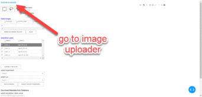

# dash-image-annotator

Image Annotator Web-app using Plotly-Dash, MongoDB, and MLflow

## Demo:

## Main Task List:

- [x] multi-page web-app
  - [x] image uploader to external MongoDB
    - [x] ingest selected images
    - [x] ingest zipped images
  - [x] annotator
    - [x] query/display images from external MongoDB
    - [x] manual annotation (save to external MongoDB)
      - [x] box
        - [x] editable
      - [x] free-hand lasso
        - [x] opened/closed
      - [x] polygon-lasso (Ctrl+MouseClick)
        - [x] opened/closed
    - [x] DeepLearning model prediction (pyfunc models on MLflow server)
      - [x] one image at a time
      - [x] batch process
- [ ] Dockerfile
- [ ] Tests
- [ ] Jupyter example notebooks:
  - [ ] database interaction
  - [ ] create train/validation splits with masks
  - [ ] upload images with pre-existing masks

## Built With:

1. python (version=3.6.7)
2. [Plotly-Dash](https://dash.plot.ly/)
3. [Visdcc](https://github.com/jimmybow/visdcc)
4. [MongoDB/GridFS](https://api.mongodb.com/python/current/api/gridfs/index.html)
5. [MLflow](https://mlflow.org/)
6. [Pillow](https://pillow.readthedocs.io/en/stable/)

## Step-By-Step Guide:

1. `$ conda create -n dash_img_app python=3.6.7`
2. `$ pip install -r requirements.txt`
3. set env variables shown in apps/config.py
   1. MLFLOW_URI variable is optional
4. `$ pyhton index.py`
5. click **Navigate to uploader** link
   1. drag and drop or select images or zipped images
6. click **Navigate to annotator** link
7. **select number of images** 
8. **select annotation_label_name**
   1. optional annotation label-name keyword filter
   2. add **!** to keyword for logical NOT
9. click **Download** button
   1. **Select Images** datatable will be populated with filenames in MongoDB
10. click a row's radio button in **Select Images** datatable to display images
11. Select manual annoation buttons for **box**. **free-hand lasso**, and **polygon-lasso**
    1.  additional button info:
        1. **polygon-lasso** requires the `Ctrl` keyboard button to be held down continuously for each mouse click. release `Ctrl` button upon completion
        2. only **boxes** can be edited
           1. toggle **Edit boxes True** after drawing boxes to make them editable
           2. boxes will appear dotted while editable
           3. toggle **Edit boxes False** to stop edit mode
        2. toggle **Close lasso** to connect starting and ending points with a staight line
        3. toggle **Open lasso** to not connect starting and ending points
12. annotation label names can be set in two ways:
    1.  edit **Select/Edit Labels** datatable labels and colors
        1.  select a row's radio button before drawing annotation
    2. click the legend to edit a lable name for a trace and `Enter` on keyboard 
13. traces can be hidden by clicking on their respective legends
14. hidden traces can be removed by clicking the **Remove Hidden Traces** button
15. annotations can be saved to the MongoDB by clicking the **Save** button

TODO: add mlflow model instructions 

### References:

1. [Example: Upload and Download Files with Plotly Dash](https://docs.faculty.ai/user-guide/apps/examples/dash_file_upload_download.html)
2. [Visdcc](https://github.com/jimmybow/visdcc)
